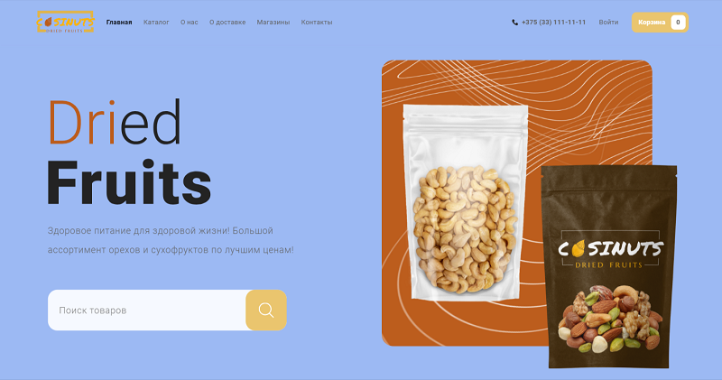
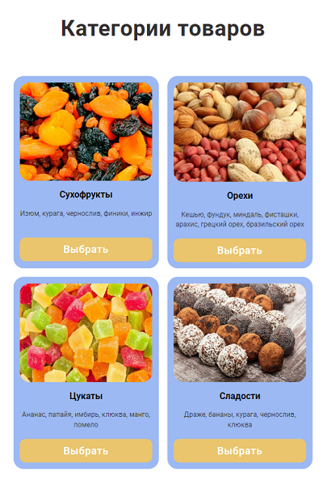
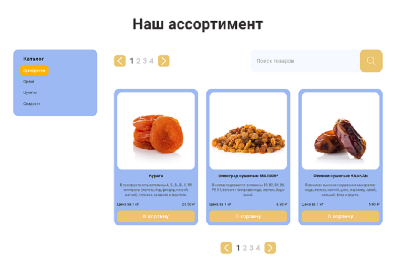

# Cosinuts

> Healthy food for a healthy life!

This project is a responsive website design using HTML, CSS and ReactJS.

## Technologies Used:

- HTML5
- CSS3
- ReactJS
- Redux Toolkit
- redux-thunk

## Structure of the project:

- used create-react-app for structure
- components and containers are functions
- completely responsive
- uses [Firebase](https://console.firebase.google.com/ "Firebase")  
  for registration on the website
- completely dynamic website
- routing with React Router

## Main project pages:

- MainPage - page contains Pages navigation, Category navigation, Search food, Social media links
- CategoryPage - list all categories on single page
- CatalogPage - page to list all the goods based on category selected
- ProductPage - page to selected good
- OrderPage - page to order selected goods
- SearchPage - page to list all the foods based on search keyword

## Getting started:

1.  Clone the repository to your local machine:

        git-clone https://github.com/sokolov-vladimir/Cosinuts.git

2.  Go into the project:

        cd cosinuts

3.  Install the necessary dependencies:

        npm install

4.  Start local dev server:

        npm start

## Some screenshots:

  
  
  

